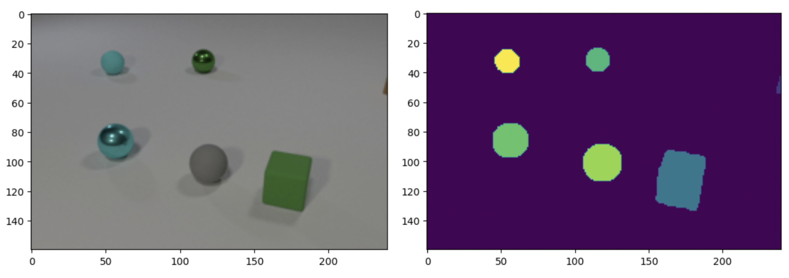
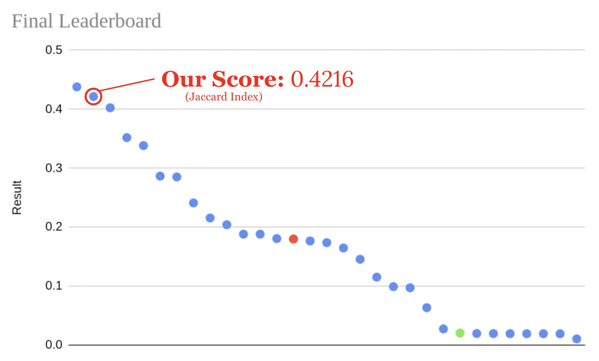

# Collision Prediction: 

__Placed 2nd in the Final Competition__ (31 Teams total)

This __collision-prediction__ repository contains Léo Dupire and Dhruv Shetty's final project code submission for the NYU graduate Deep Learning course taught by Yann LeCun and Alfredo Canziani. We are responding to the prompt specified in the [Deep_Learning_2023_Spring.pdf](./Deep_Learning_2023_Spring.pdf) file. In a few sentences, the task is as follows. _The model takes 11 consecutive images of objects (varying shape, color, and material) moving on a smooth white surface. The model must predict the segmenation mask of the scene after another 11 frames: i.e. the model must predict what position the objects will be in on the 22nd frame, approximating the underlying physics behind each object (velocity, material, collision properties, etc.)._ An example image-mask pair is shown below.

Example pair: 

Our solution consists of two [UNet](https://arxiv.org/abs/1505.04597) models. We first use a UNet for generating segmentation masks from the input images; we call this model the `Masker`. We feed the output of the Masker into the second UNet, which predicts the next mask eleven times until reaching the 22nd image. This process will be discussed further below. Note that this model takes only masks as input and ouputs a single mask; no color images are processed at this point. We call this second UNet the `Predictor`, as it predicts the subsequent positions of the objects. Naturally, we dub the combination of these two UNets, __WNet__. 

## Instructions

0. A copy of the original data is available for download at this [link](https://drive.google.com/file/d/1bHl4sEOBRDXN3Hsb6aBIoY1piPj1-Bd2/view?usp=sharing). Unzipping this in the ./WNet/data directory will create a __Dataset_Student__ folder with train, val, and unlabeled folders, each with thousands of examples of data.

1. The [Data.ipynb](./WNet/Data.ipynb) notebook converts the images in the train, val, and unlabeled folders into PyTorch tensors. This will generate the `imgs.pt`, `val_imgs.pt`, `masks.pt`, `val_masks.pt`, and `unlabeled_imgs.pt` files (no masks are provided for the unlabeled set). These all live in [./WNet/data](./WNet/data). _Note: although we have provided the code for generating `unlabeled_imgs.pt`, we encourage the use of our lazy loading implementation that directly converts the raw images into a segmentation mask tensor. This is covered in the following step._

2. Now that we have our data tensors, we can move onto the [Masker.ipynb](./WNet/Masker.ipynb) notebook. Here, we will train our Masker model using `imgs.pt` and `masks.pt`, along with our validation tensors for verification of performance. The best Masker model weights will be saved into [./WNet/masker_models](./WNet/masker_models) as `best_masker.pth`. We recommend renaming this to a unique name to avoid overwiting in the future. We use `masker.pth`.

3. We can now train our Predictor model in [Predictor.ipynb](./WNet/Predictor.ipynb). The model can be trained on the aforementioned `masks.pt` data alone, with `val_masks.pt` for validation. This implementation is the default in the notebook. However, with some simple changes, the unlabeled data can be incorporated as well. Below, two approaches are explained (Changes must be made at the indicated location under the _Load Data_ header in [Predictor.ipynb](./WNet/Predictor.ipynb)):

    * __Use full unlabeled data:__ Comment line 0 and uncomment lines 1, 2, and 3. 

    * __Use reduced unlabeled data:__ Comment line 0 and uncomment lines 1, 2, 3 __and__ 4. 

    _Tip: The tensors created by this can be saved and loaded into a new kernel to preserve memory._ 
    
    The best Predictor model weights will be saved into [./WNet/predictor_models](./WNet/predictor_models) as `best_predictor.pth`. We recommend renaming this to a unique name to avoid overwiting in the future. We use `predictor.pth`.

4. Having settled both the Masker and Predictor model architectures, two .py files ([UNet_Masker.py](./WNet/UNet_Masker.py) & [UNet_Predictor.py](./WNet/UNet_Predictor.py)) were created for the respective models to facilitate the importing of these model architectures.

    Now we can build the WNet model! The [WNet.ipynb](./WNet/WNet.ipynb) notebook can be run without training as we already have two trained models (Masker & Predictor). This is what gave us our best final Jaccard Index score of 0.4212 on the validation set. To use this best-performing model, all cells in the notebook can be run apart from those under a 'Training' header and those under the 'Option 2' header. This will generate the predictions on the hidden set at the end of the notebook.

    Although it was unfruitful in our attempts, we have left the training options available in the notebook - we didn't get far into our experimentation with this. 'Option 1' will train the WNet model on the unchanged training image data, whereas 'Option 2' will train the WNet model on the unlabeled mask data. The reasoning behind training the WNet model itself is that we are then training the model on the true task it is trying to solve (predicting the 22nd image), as opposed to training the predictor on the subtask of predicting the next mask (predicting the 12th image).

## Final Standings

Our team placed 2nd out of 31 teams in the competition. This gave us the opportunity to present our model architecture in front of Yann LeCun, Alfredo Canziani, and the entire graduate class. Below is a diagram curtosy of Jiachen Zhu (teaching assistant) showing the model performances of each group. 

The link to the presentation and subsequent Q&A will be posted below once made available.